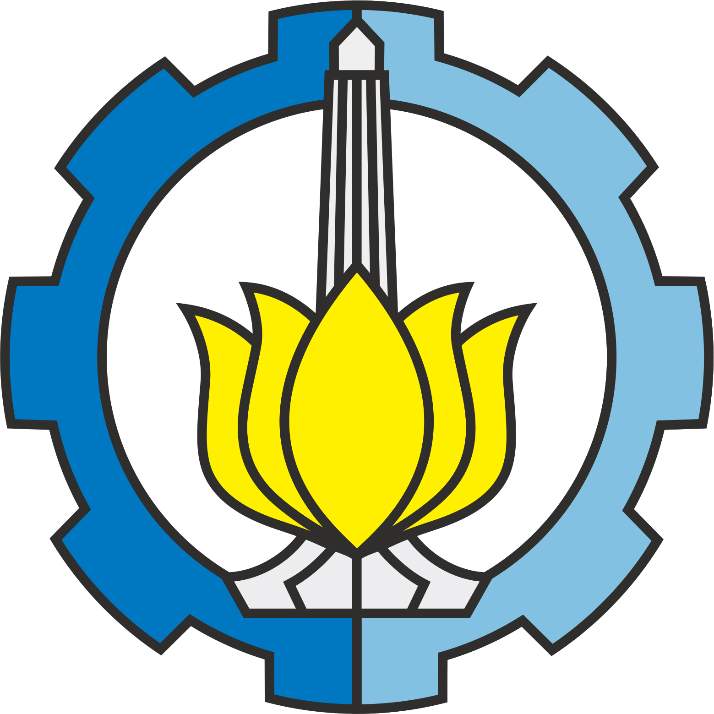

<b>Software Design Final Project (2025)</b> Institute Teknologi Sepuluh Nopember

  

Design Pattern implementation to our Final Project that was created for <a href="https://www.its.ac.id/informatika/wp-content/uploads/sites/44/2023/11/Module-Handbook-Bachelor-of-Informatics-Program-ITS.pdf">ER234301</a>.

All codes were created by <a href="https://github.com/ahhbiasa">Abhyasa</a> and <a href="https://github.com/clistdy">Callista</a>

| Name    | NRP     |
|---------|---------|
| xxxxxxx | xxxxxx  |
| xxxxxxx | xxxxxx  |

# Project Overview

# Observer Pattern

## Explanation

## Justification

# Command Pattern

## Explanation

## Justification

# References
